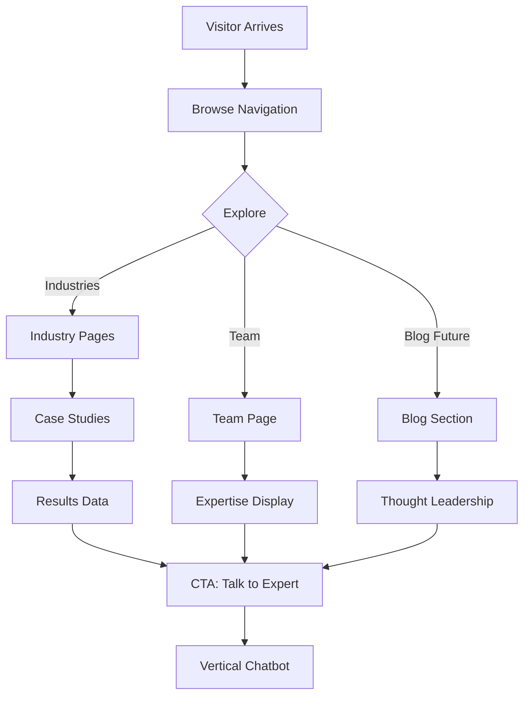
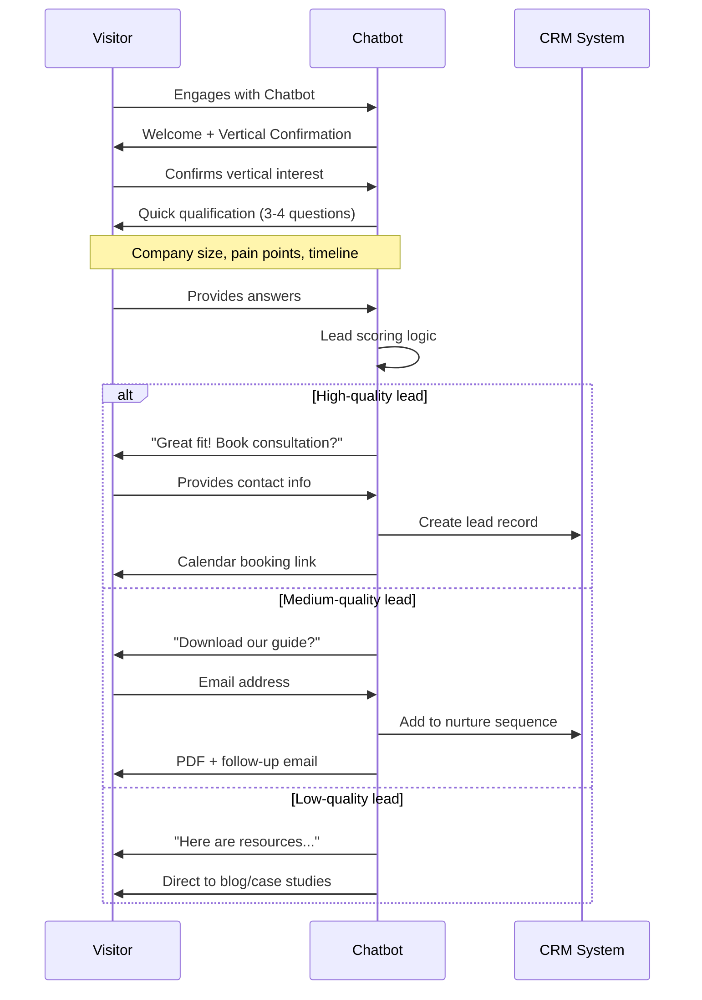

# AR Automation Website - Product Requirements Document (PRD)

**Project:** AR Automation Marketing Website
**Version:** 1.0
**Created:** October 7, 2025
**Status:** Planning Phase
**Priority:** High

---

## Executive Summary

### Problem Statement
AR Automation needs a modern, multi-language marketing website that establishes credibility as an AI automation agency while strategically guiding prospects from three distinct verticals (Accounting, E-commerce, Education) through personalized chatbot funnels to capture qualified leads.

### Solution Overview
A Next.js 15 static website with:
- **Dual-language support** (English/German) with automatic detection
- **DeepMind-inspired design** adapted to light theme with AR Automation brand colors
- **Vertical-specific chatbot funnels** for lead qualification
- **Trust-building content** showcasing proven results and case studies
- **Mobile-first responsive design** optimized for all devices

### Success Metrics
- **Primary:** Lead conversion rate (visitor → chatbot engagement → contact info captured)
- **Secondary:** Time on site, chatbot interaction rate, form completion rate
- **Technical:** Page load time <2s, 95+ Lighthouse score, 100% static generation

---

## 1. Problem & Opportunity

### Current State
- No web presence for AR Automation
- Potential clients in 3 verticals seeking automation solutions
- Need to establish authority and trust in AI automation space
- Must differentiate from generic automation vendors

### Target Audience

#### Primary Personas

**1. Oliver - Operations Director (Accounting Firm)**
- **Demographics:** 35-50 years old, managing 20-200 employee firm
- **Pain Points:**
  - Staff spending 66% of time on manual data entry
  - 300+ scattered process manuals
  - 5+ disconnected systems
- **Goals:** Reduce operational overhead, improve efficiency
- **Decision Criteria:** Proven results, industry expertise, ROI clarity

**2. Emma - E-commerce Director (Mid-sized Business)**
- **Demographics:** 30-45 years old, €1-10M revenue business
- **Pain Points:**
  - Fragmented systems (inventory, CRM, logistics)
  - Customer service bottlenecks
  - Content generation time drain
- **Goals:** Scale without proportional staff increases
- **Decision Criteria:** Integration capabilities, fast implementation

**3. Dr. Schmidt - University Registrar (Educational Institution)**
- **Demographics:** 40-60 years old, 10,000+ students
- **Pain Points:**
  - Multilingual student registration (3+ hours each)
  - Administrative overhead consuming 24% of budget
  - Compliance and accreditation workflows
- **Goals:** Reduce admin time, improve student satisfaction
- **Decision Criteria:** FERPA compliance, multilingual support, proven educational experience

### Business Opportunity
- **Market Size:** Mid-sized organizations (€1-10M revenue or 20-200 employees)
- **Conversion Goal:** 3-5% of qualified visitors → consultation bookings
- **Revenue Impact:** Average engagement value $200K-$2M annually per client

---

## 2. User Journeys & Flows

### Primary User Journey: Vertical-Specific Lead Funnel

```mermaid
graph TD
    A[Visitor Arrives] --> B{Language Detection}
    B -->|Browser=DE| C[/de Homepage]
    B -->|Browser=EN| D[/en Homepage]

    C --> E[Hero Section]
    D --> E

    E --> F{User Interest}
    F -->|Accounting| G[Accounting Vertical Section]
    F -->|E-commerce| H[E-commerce Vertical Section]
    F -->|Education| I[Education Vertical Section]
    F -->|Explore| J[Solutions Overview]

    G --> K[Accounting Pain Points]
    H --> L[E-commerce Pain Points]
    I --> M[Education Pain Points]

    K --> N[Accounting Chatbot CTA]
    L --> O[E-commerce Chatbot CTA]
    M --> P[Education Chatbot CTA]

    N --> Q[Chatbot Qualification]
    O --> Q
    P --> Q

    Q --> R{Qualified?}
    R -->|Yes| S[Calendar Booking]
    R -->|No| T[Resource Download]

    S --> U[Lead Captured ✓]
    T --> V[Email Capture]
    V --> U
```

### Alternative Journey: Content Explorer



### Chatbot Conversation Flow



---

## 3. Design System & Brand

### Color Palette

```css
/* Primary Colors */
--primary-dark: #003049;      /* Main headings, primary CTAs */
--primary-light: #669BBC;     /* Secondary elements, hover states */

/* Accent Colors */
--accent-red: #780000;        /* Strategic highlights, urgent CTAs */
--accent-cream: #FDF0D5;      /* Background sections, cards */

/* Neutral Colors */
--neutral-dark: #363636;      /* Body text, secondary backgrounds */
--neutral-light: #F5F5F5;     /* Page background */
--white: #FFFFFF;             /* Cards, content areas */
```

### Typography System

```typescript
// Font Stack (using system fonts for performance)
const typography = {
  heading: {
    fontFamily: "-apple-system, BlinkMacSystemFont, 'Segoe UI', sans-serif",
    weights: {
      h1: 700,  // 48px-64px
      h2: 600,  // 36px-48px
      h3: 600,  // 24px-32px
      h4: 500,  // 20px-24px
    }
  },
  body: {
    fontFamily: "-apple-system, BlinkMacSystemFont, 'Segoe UI', sans-serif",
    weights: {
      regular: 400,
      medium: 500,
      semibold: 600,
    },
    sizes: {
      large: '18px',
      base: '16px',
      small: '14px',
    }
  }
}
```

### Spacing System

```typescript
// 8px base unit for consistent spacing
const spacing = {
  xs: '4px',
  sm: '8px',
  md: '16px',
  lg: '24px',
  xl: '32px',
  '2xl': '48px',
  '3xl': '64px',
  '4xl': '96px',
}
```

### Component Patterns

**Navigation**
- Thin top bar (height: 64px)
- Logo left, menu center, CTA right
- Minimal dropdown with subtle shadows
- Sticky on scroll with subtle border bottom

**Hero Section**
- Full-width container, max-width: 1440px
- Split layout: 60% text, 40% visual
- Primary CTA + Secondary link
- Subtle background pattern or gradient

**Vertical Cards**
- 3-column grid on desktop
- Hover: subtle lift + shadow increase
- Icon/illustration + title + description + CTA
- Direct link to chatbot for each vertical

**Trust Indicators**
- Client logo carousel (grayscale → color on hover)
- Stat counters (20-30 hours saved, 66% productivity gain)
- Case study cards with pull quotes
- Certification badges (Microsoft Partner, etc.)

---

## 4. Technical Architecture

### System Overview

```mermaid
graph TB
    subgraph "Frontend - Next.js 15"
        A[App Router] --> B[Middleware: i18n]
        B --> C[/en Routes]
        B --> D[/de Routes]

        C --> E[Pages Components]
        D --> E

        E --> F[Reusable Components]
        F --> G[Navigation]
        F --> H[Hero Sections]
        F --> I[Chatbot Widgets]
    end

    subgraph "Content Management"
        J[Translation Files]
        J --> K[/public/locales/en/]
        J --> L[/public/locales/de/]
    end

    subgraph "Third-Party Integrations"
        M[Chatbot Platform]
        N[Analytics]
        O[CRM Integration]
    end

    E --> M
    E --> N
    M --> O

    subgraph "Deployment"
        P[GitHub Actions]
        P --> Q[Build Static Site]
        Q --> R[GitHub Pages]
    end

    A --> P
```

### Technology Stack

#### Core Framework
- **Next.js 15.0.2** - App Router, static export
- **React 18** - Component architecture
- **TypeScript 5** - Type safety

#### Styling & UI
- **Tailwind CSS 3.4.1** - Utility-first styling
- **Custom design tokens** - Brand color system
- **CSS Modules** (optional) - Component-scoped styles

#### Internationalization
- **next-intl** - Recommended for App Router i18n
  - Middleware-based routing
  - JSON translation files
  - Automatic locale detection
  - Type-safe translations

#### Chatbot Integration (Future)
- **Intercom / Drift / Custom** - TBD
- **Placeholder components** - Initial implementation
- **Event tracking** - Conversion analytics

#### Analytics & Tracking
- **Google Analytics 4** - Traffic and behavior
- **Microsoft Clarity** (optional) - Session recordings
- **Custom event tracking** - Chatbot interactions

#### Deployment & Hosting
- **GitHub Pages** - Static hosting
- **GitHub Actions** - CI/CD pipeline
- **Cloudflare** (optional) - CDN + performance

### Folder Structure

```
ARAutomationWebsite2/
├── app/
│   ├── [locale]/              # Dynamic locale routing
│   │   ├── layout.tsx         # Locale-specific layout
│   │   ├── page.tsx           # Homepage
│   │   ├── industries/
│   │   │   ├── accounting/
│   │   │   │   └── page.tsx
│   │   │   ├── ecommerce/
│   │   │   │   └── page.tsx
│   │   │   └── education/
│   │   │       └── page.tsx
│   │   ├── team/
│   │   │   └── page.tsx
│   │   └── contact/
│   │       └── page.tsx
│   ├── globals.css
│   └── layout.tsx             # Root layout
├── components/
│   ├── navigation/
│   │   ├── Navigation.tsx
│   │   ├── LanguageSwitcher.tsx
│   │   └── MobileMenu.tsx
│   ├── hero/
│   │   ├── HeroSection.tsx
│   │   └── VerticalCards.tsx
│   ├── chatbot/
│   │   ├── ChatbotWidget.tsx
│   │   └── ChatbotPlaceholder.tsx
│   ├── shared/
│   │   ├── Button.tsx
│   │   ├── Card.tsx
│   │   └── Section.tsx
│   └── footer/
│       └── Footer.tsx
├── lib/
│   ├── i18n/
│   │   ├── config.ts
│   │   └── request.ts
│   └── utils.ts
├── public/
│   ├── locales/
│   │   ├── en/
│   │   │   ├── common.json
│   │   │   ├── homepage.json
│   │   │   └── industries.json
│   │   └── de/
│   │       ├── common.json
│   │       ├── homepage.json
│   │       └── industries.json
│   ├── images/
│   └── .nojekyll
├── middleware.ts              # i18n routing logic
└── next.config.js
```

---

## 5. Page Specifications

### 5.1 Homepage (Priority 1)

**Route:** `/[locale]` (e.g., `/en`, `/de`)

#### Layout Components

**1. Navigation Bar**
```typescript
interface NavigationProps {
  locale: 'en' | 'de';
  currentPath: string;
}

// Features:
// - Logo (left) → links to /[locale]
// - Menu items (center): Industries (dropdown), Team, Resources
// - Language switcher (EN | DE)
// - "Get in Touch" CTA button (right)
// - Sticky on scroll with shadow
```

**2. Hero Section**
```typescript
interface HeroSectionProps {
  locale: 'en' | 'de';
  title: string;
  subtitle: string;
  primaryCTA: CTAButton;
  secondaryCTA?: CTAButton;
  visualAsset?: string; // Image or illustration
}

// Content:
// EN: "Automate the boring stuff. Build the business you dreamed of."
// DE: "Automatisieren Sie das Langweilige. Bauen Sie das Unternehmen Ihrer Träume."
//
// Primary CTA: "Schedule Free Audit"
// Secondary CTA: "See How It Works"
```

**3. Three Verticals Section**
```typescript
interface VerticalCard {
  id: 'accounting' | 'ecommerce' | 'education';
  icon: ReactNode;
  title: string;
  description: string;
  painPoints: string[];
  results: string[];
  ctaLabel: string;
  ctaLink: string;
  chatbotTrigger: string; // ID for chatbot variant
}

// Layout: 3-column grid
// Each card:
// - Icon/illustration (top)
// - Title (H3)
// - Pain points (3-4 bullets)
// - Results achieved (2-3 stats)
// - "Learn More" button → industry page
// - "Talk to Expert" button → chatbot
```

**4. Solutions Overview Section**
```typescript
interface SolutionFeature {
  title: string;
  description: string;
  visual: string;
  benefits: string[];
}

// 4 main solutions (inspired by DeepMind's "Start Building" section):
// 1. Intelligent Process Automation
// 2. AI Knowledge Systems
// 3. Unified Digital Workspaces
// 4. Customer Service Automation
//
// Layout: Alternating left/right image+text sections
```

**5. Trust Indicators Section**
```typescript
interface TrustIndicators {
  stats: Stat[];
  clients: Client[];
  certifications: Certification[];
}

interface Stat {
  value: string; // "20-30 hours"
  label: string; // "saved per week"
}

// Components:
// - Animated counter stats (4-6 key metrics)
// - Client logo carousel
// - Microsoft Partner badge
// - Case study highlights
```

**6. Call-to-Action Section**
```typescript
interface CTASection {
  headline: string;
  subheadline: string;
  primaryCTA: CTAButton;
  secondaryCTA?: CTAButton;
  riskReversal?: string; // "If we can't find 15% efficiency gains, audit is free"
}

// Style: Accent background (cream or light blue)
// Centered, prominent positioning
```

**7. Footer**
```typescript
interface Footer {
  navigationLinks: NavigationGroup[];
  socialLinks: SocialLink[];
  newsletter?: NewsletterSignup;
  legalLinks: Link[];
}

// Layout:
// - Multi-column link groups
// - Social icons
// - Newsletter signup (optional)
// - Copyright + legal links
```

---

### 5.2 Industry Pages (Priority 2)

**Routes:**
- `/[locale]/industries/accounting`
- `/[locale]/industries/ecommerce`
- `/[locale]/industries/education`

#### Page Structure

**1. Industry Hero**
- Specific headline addressing vertical
- Key pain point statement
- Primary CTA: "Talk to [Vertical] Specialist" → chatbot
- Background: Subtle industry-related visual

**2. Pain Points Deep Dive**
- 4-6 specific pain points expanded
- Each with:
  - Icon
  - Title
  - Description
  - "Before AR Automation" scenario
  - Quick stat

**3. Solutions Section**
- How AR Automation solves each pain point
- Specific features/capabilities
- Integration examples
- Implementation timeline

**4. Case Study Spotlight**
```typescript
interface CaseStudy {
  client: string; // "Mid-sized Accounting Firm" (anonymized if needed)
  challenge: string;
  solution: string;
  results: {
    metric: string;
    improvement: string;
  }[];
  quote?: string;
  visual?: string;
}
```

**5. Results Grid**
- 6-8 key metrics specific to vertical
- Before/after comparisons
- Visual representation (charts/graphs)

**6. Chatbot CTA**
- Full-width section
- "Ready to achieve similar results?"
- "Talk to a [Vertical] Automation Specialist" → launches vertical-specific chatbot
- Alternative: "Schedule 45-min Audit" → calendar link

---

### 5.3 Team Page (Priority 3)

**Route:** `/[locale]/team`

**Components:**
- Team member cards
- Expertise areas
- "Why we're different" section
- Partnership approach explanation

---

### 5.4 Contact Page (Priority 3)

**Route:** `/[locale]/contact`

**Components:**
- Contact form (name, email, company, vertical, message)
- Direct contact information
- "Or chat with us now" → general chatbot
- Office locations (if applicable)

---

## 6. Internationalization (i18n) Specifications

### Configuration

**next.config.js**
```javascript
const isProd = process.env.NODE_ENV === 'production';

/** @type {import('next').NextConfig} */
const nextConfig = {
  output: 'export',
  basePath: isProd ? '/ARAutomationWebsite2' : '',
  assetPrefix: isProd ? '/ARAutomationWebsite2/' : '',
  images: {
    unoptimized: true,
  },
  // Note: i18n config not needed with next-intl middleware approach
}

module.exports = nextConfig
```

**middleware.ts**
```typescript
import createMiddleware from 'next-intl/middleware';

export default createMiddleware({
  // Supported locales
  locales: ['en', 'de'],

  // Default locale
  defaultLocale: 'en',

  // Automatic locale detection
  localeDetection: true,

  // Locale prefix strategy
  localePrefix: 'always' // Always show /en or /de in URL
});

export const config = {
  // Match all pathnames except:
  // - /api routes
  // - /_next (Next.js internals)
  // - Files with extensions (e.g., favicon.ico)
  matcher: ['/((?!api|_next|.*\\..*).*)']
};
```

**lib/i18n/request.ts**
```typescript
import { getRequestConfig } from 'next-intl/server';

export default getRequestConfig(async ({ locale }) => ({
  messages: (await import(`../../public/locales/${locale}/common.json`)).default
}));
```

### Translation File Structure

**public/locales/en/common.json**
```json
{
  "nav": {
    "home": "Home",
    "industries": "Industries",
    "team": "Team",
    "contact": "Get in Touch"
  },
  "hero": {
    "title": "Automate the boring stuff. Build the business you dreamed of.",
    "subtitle": "AR Automation helps mid-sized organizations escape operational chaos by connecting fragmented systems and automating repetitive tasks.",
    "primaryCTA": "Schedule Free Audit",
    "secondaryCTA": "See How It Works"
  },
  "verticals": {
    "accounting": {
      "title": "Accounting Firms",
      "description": "Stop drowning in manual data entry. Reclaim 20-30% of staff time.",
      "ctaLearn": "Learn More",
      "ctaChat": "Talk to Expert"
    }
    // ... more translations
  }
}
```

**public/locales/de/common.json**
```json
{
  "nav": {
    "home": "Startseite",
    "industries": "Branchen",
    "team": "Team",
    "contact": "Kontakt"
  },
  "hero": {
    "title": "Automatisieren Sie das Langweilige. Bauen Sie das Unternehmen Ihrer Träume.",
    "subtitle": "AR Automation hilft mittelständischen Unternehmen, operatives Chaos zu überwinden, indem fragmentierte Systeme verbunden und repetitive Aufgaben automatisiert werden.",
    "primaryCTA": "Kostenloses Audit buchen",
    "secondaryCTA": "Sehen Sie, wie es funktioniert"
  }
  // ... more translations
}
```

### Language Switcher Component

```typescript
'use client';

import { useRouter, usePathname } from 'next/navigation';
import { useLocale } from 'next-intl';

export function LanguageSwitcher() {
  const router = useRouter();
  const pathname = usePathname();
  const locale = useLocale();

  const switchLocale = (newLocale: string) => {
    // Replace current locale in pathname
    const newPath = pathname.replace(`/${locale}`, `/${newLocale}`);
    router.push(newPath);
  };

  return (
    <div className="flex items-center gap-2">
      <button
        onClick={() => switchLocale('en')}
        className={`px-2 py-1 text-sm ${locale === 'en' ? 'font-bold' : ''}`}
      >
        EN
      </button>
      <span className="text-gray-400">|</span>
      <button
        onClick={() => switchLocale('de')}
        className={`px-2 py-1 text-sm ${locale === 'de' ? 'font-bold' : ''}`}
      >
        DE
      </button>
    </div>
  );
}
```

---

## 7. Chatbot Integration Strategy

### Chatbot Variants

```typescript
interface ChatbotConfig {
  id: string;
  vertical: 'accounting' | 'ecommerce' | 'education' | 'general';
  initialMessage: string;
  qualificationQuestions: Question[];
  scoringRules: ScoringRule[];
  routingLogic: RoutingLogic;
}

const chatbotVariants: ChatbotConfig[] = [
  {
    id: 'accounting-chatbot',
    vertical: 'accounting',
    initialMessage: "Hi! I specialize in helping accounting firms automate their workflows. Can I ask a few quick questions?",
    qualificationQuestions: [
      {
        id: 'firm-size',
        text: 'How many employees are in your firm?',
        type: 'multiple-choice',
        options: ['1-20', '20-50', '50-200', '200+'],
        scoring: { '20-50': 10, '50-200': 15, '1-20': 5, '200+': 8 }
      },
      {
        id: 'pain-point',
        text: 'What's your biggest operational challenge?',
        type: 'multiple-choice',
        options: [
          'Manual data entry consuming too much time',
          'Disconnected systems requiring duplicate work',
          'Finding information in scattered documents',
          'Unable to scale without hiring more staff'
        ],
        scoring: { 'Manual data entry': 10, 'Disconnected systems': 12 }
      },
      {
        id: 'timeline',
        text: 'When are you looking to implement a solution?',
        type: 'multiple-choice',
        options: ['Immediately', 'Within 3 months', '3-6 months', 'Just researching'],
        scoring: { 'Immediately': 15, 'Within 3 months': 10, '3-6 months': 5 }
      },
      {
        id: 'budget-authority',
        text: 'Are you involved in purchasing decisions?',
        type: 'yes-no',
        scoring: { 'Yes': 10, 'No': 2 }
      }
    ],
    scoringRules: {
      highQuality: { min: 35, action: 'book-consultation' },
      mediumQuality: { min: 20, action: 'download-guide' },
      lowQuality: { min: 0, action: 'nurture-content' }
    },
    routingLogic: {
      highQuality: {
        message: "You're a great fit! I'd love to connect you with one of our accounting automation specialists.",
        cta: "Book 45-minute consultation",
        form: ['name', 'email', 'phone', 'company']
      },
      mediumQuality: {
        message: "I think you'd find our Accounting Automation Guide helpful.",
        cta: "Download Free Guide",
        form: ['name', 'email', 'company']
      },
      lowQuality: {
        message: "Here are some resources to help you explore automation options.",
        cta: "View Resources",
        links: ['/case-studies', '/blog']
      }
    }
  },
  // Similar configs for ecommerce, education, general
];
```

### Placeholder Implementation (Phase 1)

```typescript
// components/chatbot/ChatbotPlaceholder.tsx
'use client';

interface ChatbotPlaceholderProps {
  vertical: 'accounting' | 'ecommerce' | 'education' | 'general';
  locale: 'en' | 'de';
}

export function ChatbotPlaceholder({ vertical, locale }: ChatbotPlaceholderProps) {
  const handleClick = () => {
    // Phase 1: Redirect to contact form with vertical pre-filled
    const contactUrl = `/${locale}/contact?vertical=${vertical}`;
    window.location.href = contactUrl;

    // Phase 2: Launch actual chatbot
    // window.ChatbotSDK.open({ variant: vertical });
  };

  return (
    <button
      onClick={handleClick}
      className="fixed bottom-6 right-6 bg-primary-dark text-white px-6 py-3 rounded-full shadow-lg hover:shadow-xl transition-shadow"
    >
      💬 Talk to {vertical === 'general' ? 'an' : 'a'} {vertical} specialist
    </button>
  );
}
```

### Future Chatbot Integration (Phase 2)

**Recommended Platforms:**
1. **Intercom** - Strong for B2B, good CRM integration
2. **Drift** - Optimized for sales funnels
3. **Custom Solution** - Built with LangChain + OpenAI API

**Integration Points:**
- CRM sync (HubSpot, Salesforce, etc.)
- Calendar booking (Calendly, Cal.com)
- Email automation (Mailchimp, SendGrid)
- Analytics tracking (GA4, Mixpanel)

---

## 8. Data Models

### Lead Capture Schema

```typescript
interface Lead {
  id: string;
  createdAt: Date;
  updatedAt: Date;

  // Contact Info
  name: string;
  email: string;
  phone?: string;
  company: string;

  // Qualification Data
  vertical: 'accounting' | 'ecommerce' | 'education' | 'general';
  companySize?: string;
  painPoints: string[];
  timeline?: string;
  budgetAuthority?: boolean;

  // Engagement Tracking
  source: 'chatbot' | 'form' | 'newsletter';
  chatbotVariant?: string;
  chatbotScore?: number;
  pageViewed: string[];
  timeOnSite: number;

  // Status
  status: 'new' | 'contacted' | 'qualified' | 'nurture' | 'closed';
  assignedTo?: string;

  // Language
  locale: 'en' | 'de';
}
```

### Analytics Events

```typescript
interface AnalyticsEvent {
  event: string;
  properties: {
    page: string;
    locale: string;
    vertical?: string;
    action: string;
    label?: string;
    value?: number;
  };
  timestamp: Date;
  sessionId: string;
  userId?: string;
}

// Key events to track:
// - page_view
// - chatbot_opened
// - chatbot_engaged
// - chatbot_qualified
// - form_submitted
// - cta_clicked
// - video_played
// - resource_downloaded
```

---

## 9. Implementation Phases

### Phase 1: Foundation & Homepage ✅ **COMPLETED**

**Status**: Completed October 7, 2025

#### Foundation & Design System ✅
- [x] Next.js project initialization
- [x] GitHub Pages deployment configured
- [x] Design system setup (Tailwind config with brand colors)
- [x] Base component library (Button, Card, Section)
- [x] Responsive breakpoints configured

#### Homepage - English Only ✅
- [x] Navigation component with mobile menu
- [x] Hero section with brand messaging
- [x] Three vertical cards section (Accounting, E-commerce, Education)
- [x] Solutions overview section (4 solutions)
- [x] Trust indicators section (stats, client logos, certifications)
- [x] CTA section with risk reversal
- [x] Footer component (multi-column)
- [x] Mobile responsive optimization
- [x] TypeScript: 0 errors, ESLint: 0 warnings
- [x] Production build successful

**Rationale:** Following KISS and YAGNI principles - build visual foundation first, validate design and UX. Fast feedback loop without translation overhead.

**Next Steps**: Deploy to GitHub Pages, then customize design elements and add internationalization.

---

### Phase 2: Design Refinement & Deployment

**Priority**: High - Test on real devices

#### Design Customization
- [ ] Deploy Phase 1 to GitHub Pages
- [ ] Test mobile appearance on real devices
- [ ] Customize visual elements (colors, spacing, typography tweaks)
- [ ] Add visual assets (placeholder images, icons)
- [ ] Refine responsive breakpoints based on device testing
- [ ] Optimize component styling and interactions

#### Performance & Accessibility
- [ ] Run Lighthouse audit on deployed site
- [ ] Optimize for 95+ scores across all metrics
- [ ] Test cross-browser compatibility
- [ ] Accessibility audit (WCAG 2.1 AA)

**Rationale:** Deploy early to validate design on real devices. Iterate on visuals before adding i18n complexity.

---

### Phase 3: Internationalization & German Translation

**Priority**: Medium - Add after design is validated

#### i18n Infrastructure
- [ ] Install and configure next-intl
- [ ] Set up translation file structure (/public/locales/en/ and /de/)
- [ ] Create middleware for locale routing
- [ ] Refactor homepage components to use translation hooks
- [ ] Extract all hardcoded English strings to translation files

#### Language Implementation
- [ ] Implement language switcher component
- [ ] Add German translations for all content
- [ ] Test language switching functionality
- [ ] Test both locales across all browsers
- [ ] Deploy bilingual site to GitHub Pages
- [ ] Set up Google Analytics 4 with locale tracking

**Rationale:** Progressive enhancement - add i18n layer after English homepage is validated and working on real devices.

### Phase 4: Industry-Specific Pages

**Priority**: High - Core lead generation pages

#### Accounting Vertical Page
- [ ] Accounting industry page with deep pain points
- [ ] Solutions section specific to accounting firms
- [ ] Case study spotlight (Grant Thornton, Mengali)
- [ ] Results grid with before/after metrics
- [ ] Vertical-specific chatbot trigger
- [ ] Translation (EN + DE)

#### E-commerce Vertical Page
- [ ] E-commerce industry page (mirror accounting structure)
- [ ] E-commerce-specific solutions and pain points
- [ ] Case study spotlight
- [ ] Results grid
- [ ] Vertical-specific chatbot trigger
- [ ] Translation (EN + DE)

#### Education Vertical Page
- [ ] Education industry page (mirror accounting structure)
- [ ] Education-specific solutions (FERPA compliance, multilingual)
- [ ] Case study spotlight
- [ ] Results grid
- [ ] Vertical-specific chatbot trigger
- [ ] Translation (EN + DE)

#### Integration & SEO
- [ ] Cross-linking between homepage and industry pages
- [ ] SEO optimization (meta tags, structured data)
- [ ] Test vertical chatbot funnels
- [ ] Deploy all industry pages

**Rationale:** Industry pages are critical for lead qualification and conversion. Build after homepage is validated.

---

### Phase 5: Supporting Pages

**Priority**: Medium - Build credibility and contact options

#### Team Page
- [ ] Team page with member profiles and expertise
- [ ] "Why we're different" section
- [ ] Partnership approach explanation
- [ ] Translation (EN + DE)

#### Contact Page
- [ ] Contact page with form (name, email, company, vertical, message)
- [ ] Form validation and submission handling
- [ ] Direct contact information display
- [ ] "Or chat with us now" general chatbot link
- [ ] Email notification setup
- [ ] Translation (EN + DE)

#### Blog Foundation (Optional)
- [ ] Blog listing page
- [ ] Blog post template with markdown support
- [ ] 2-3 initial blog posts (thought leadership)
- [ ] RSS feed generation
- [ ] Translation strategy for blog content

**Rationale:** Supporting pages build trust and provide alternative conversion paths beyond chatbot.

---

### Phase 6: Chatbot Integration

**Priority**: High - Primary lead capture mechanism

#### Platform Selection & Setup
- [ ] Evaluate chatbot platforms (Intercom, Drift, Custom LangChain solution)
- [ ] Select platform based on B2B features and CRM integration
- [ ] Set up chatbot account and configure
- [ ] Design vertical-specific conversation flows
- [ ] Set up qualification logic and scoring rules

#### Implementation
- [ ] Replace placeholder with actual chatbot widget
- [ ] Configure vertical-specific chatbot variants
- [ ] Connect to CRM (HubSpot, Salesforce, or similar)
- [ ] Set up calendar booking integration (Calendly, Cal.com)
- [ ] Train chatbot on AR Automation knowledge base
- [ ] Implement lead routing logic

#### Testing & Optimization
- [ ] Test all conversation paths for each vertical
- [ ] A/B test different messaging approaches
- [ ] Analyze chatbot metrics (engagement, qualification rates)
- [ ] Refine qualification questions based on data
- [ ] Improve conversation flows
- [ ] Add FAQ capabilities
- [ ] Set up automated follow-ups

**Rationale:** Chatbot is core to lead qualification strategy. Build after pages are validated to ensure context is right.

---

### Phase 7: Optimization & Growth (Ongoing)

#### Content Expansion
- [ ] Regular blog posts (1-2 per month)
- [ ] Case study deep dives
- [ ] Video content integration
- [ ] Webinar landing pages
- [ ] Resource library

#### Conversion Optimization
- [ ] A/B test hero messaging
- [ ] Test CTA button variations
- [ ] Optimize chatbot placement
- [ ] Refine vertical targeting
- [ ] Implement exit-intent popups

#### Technical Enhancements
- [ ] Add animations and micro-interactions
- [ ] Implement lazy loading for images
- [ ] Set up CDN for global performance
- [ ] Add progressive web app (PWA) features
- [ ] Implement advanced analytics

---

## 10. Success Metrics & KPIs

### Primary Metrics (Lead Generation)

```typescript
interface LeadMetrics {
  // Conversion Funnel
  totalVisitors: number;
  chatbotEngagements: number;
  chatbotEngagementRate: number; // chatbotEngagements / totalVisitors

  leadsGenerated: number;
  leadConversionRate: number; // leadsGenerated / totalVisitors

  qualifiedLeads: number;
  qualificationRate: number; // qualifiedLeads / leadsGenerated

  consultationsBooked: number;
  bookingRate: number; // consultationsBooked / qualifiedLeads

  // Vertical Performance
  verticalBreakdown: {
    accounting: VerticalMetrics;
    ecommerce: VerticalMetrics;
    education: VerticalMetrics;
  };
}

interface VerticalMetrics {
  visitors: number;
  engagements: number;
  leads: number;
  qualifiedLeads: number;
  conversions: number;
}
```

**Targets:**
- **Chatbot Engagement Rate:** 15-25%
- **Lead Conversion Rate:** 3-5%
- **Qualification Rate:** 40-60%
- **Consultation Booking Rate:** 30-50%

### Secondary Metrics (Engagement)

```typescript
interface EngagementMetrics {
  // Time & Depth
  avgTimeOnSite: number; // Target: 3-5 minutes
  avgPagesPerSession: number; // Target: 3-4 pages
  bounceRate: number; // Target: <40%

  // Content Performance
  topLandingPages: PageMetric[];
  topExitPages: PageMetric[];
  mostViewedContent: PageMetric[];

  // User Journey
  commonUserPaths: Path[];
  verticalAffinity: {
    accounting: number;
    ecommerce: number;
    education: number;
  };
}
```

### Technical Metrics (Performance)

```typescript
interface TechnicalMetrics {
  // Performance
  lighthouseScore: number; // Target: 95+
  pageLoadTime: number; // Target: <2s
  timeToInteractive: number; // Target: <3s

  // Reliability
  uptime: number; // Target: 99.9%
  errorRate: number; // Target: <0.1%

  // Accessibility
  wcagCompliance: 'AA' | 'AAA'; // Target: AA minimum
}
```

### Monthly Reporting Dashboard

```markdown
## AR Automation Website - Monthly Report

### Lead Generation (Primary Goal)
- Total Visitors: 2,500
- Chatbot Engagements: 500 (20%)
- Leads Generated: 100 (4%)
- Qualified Leads: 60 (60%)
- Consultations Booked: 25 (42%)

### Vertical Performance
| Vertical   | Visitors | Engagements | Leads | Qualified | Booked |
|------------|----------|-------------|-------|-----------|--------|
| Accounting | 900      | 200 (22%)   | 40    | 28 (70%)  | 12     |
| E-commerce | 800      | 180 (22%)   | 35    | 20 (57%)  | 8      |
| Education  | 600      | 90 (15%)    | 18    | 10 (56%)  | 4      |
| General    | 200      | 30 (15%)    | 7     | 2 (29%)   | 1      |

### Engagement Metrics
- Avg Time on Site: 4:32
- Avg Pages/Session: 3.8
- Bounce Rate: 35%
- Return Visitor Rate: 18%

### Technical Performance
- Lighthouse Score: 97
- Page Load Time: 1.8s
- Uptime: 99.95%
- Zero critical errors

### Key Insights
- Accounting vertical shows highest qualification rate (70%)
- Mobile traffic represents 45% of total visitors
- German language pages account for 25% of traffic
- Blog posts drive 15% of inbound traffic

### Action Items
- Increase focus on accounting vertical (best converter)
- Optimize mobile chatbot experience
- Expand German language content
- Create more case studies for education vertical
```

---

## 11. Risk Analysis & Mitigation

### Technical Risks

#### Risk: i18n Routing Complexity
**Impact:** Medium
**Probability:** Medium
**Description:** Next.js 15 App Router i18n implementation is newer and less documented than Pages Router approach.

**Mitigation:**
- Use well-established library (next-intl) with active community
- Allocate extra time for i18n setup and testing
- Create comprehensive testing checklist for both locales
- Document any custom solutions for future reference

#### Risk: Static Export Limitations
**Impact:** Low
**Probability:** Low
**Description:** Static export prevents use of certain Next.js features (API routes, server actions).

**Mitigation:**
- Design architecture around static generation from start
- Use client-side data fetching for dynamic content
- Plan for external APIs (chatbot, forms) via third-party services
- Document any workarounds needed

#### Risk: GitHub Pages Deployment Issues
**Impact:** Medium
**Probability:** Low
**Description:** basePath configuration or GitHub Actions could cause deployment failures.

**Mitigation:**
- Test production build locally before deploying
- Create rollback strategy (previous deployment snapshots)
- Set up deployment monitoring and alerts
- Have backup hosting plan (Vercel, Netlify)

### Business Risks

#### Risk: Low Conversion Rates
**Impact:** High
**Probability:** Medium
**Description:** Website doesn't convert visitors to leads at expected rate.

**Mitigation:**
- Implement A/B testing framework from start
- Set up comprehensive analytics tracking
- Create multiple CTA variations to test
- Plan for iterative optimization cycles
- Have content strategy for SEO to increase traffic

#### Risk: Chatbot Integration Delays
**Impact:** Medium
**Probability:** Medium
**Description:** Chatbot platform selection or integration takes longer than expected.

**Mitigation:**
- Implement placeholder functionality in Phase 1
- Website still functional with contact forms
- Evaluate platforms early (before Phase 4)
- Have backup option (simple contact form) ready
- Consider starting with one vertical's chatbot first

#### Risk: Translation Quality Issues
**Impact:** Medium
**Probability:** Medium
**Description:** German translations are inaccurate or not culturally appropriate.

**Mitigation:**
- Use professional translation service (not machine translation)
- Have native German speaker review all content
- Test with German-speaking users before launch
- Create translation style guide
- Budget for translation iterations

### Content Risks

#### Risk: Insufficient Content at Launch
**Impact:** Medium
**Probability:** Low
**Description:** Not enough content to establish authority and trust.

**Mitigation:**
- Prioritize homepage and top-performing pages first
- Use case studies from business overview document
- Create content calendar for ongoing blog posts
- Launch with MVP content, expand iteratively
- Focus on quality over quantity

#### Risk: Message Inconsistency Across Locales
**Impact:** Low
**Probability:** Medium
**Description:** English and German messaging doesn't align, causing brand confusion.

**Mitigation:**
- Create master messaging document in English first
- Translate with context, not just words
- Maintain glossary of key terms and their translations
- Review both languages side-by-side
- Get feedback from bilingual team members

---

## 12. Dependencies & Constraints

### Technical Dependencies

**Required:**
- Next.js 15.0.2 (already installed)
- next-intl (to be installed)
- GitHub Pages hosting
- Domain name (if custom domain desired)

**Nice-to-Have:**
- Chatbot platform subscription (Phase 4)
- Analytics platform (Google Analytics 4 - free)
- CRM system integration (depends on existing CRM)

### Content Dependencies

**Required:**
- Professional copywriting for homepage (can use business overview as source)
- German translations (professional service recommended)
- Client logos (permissions needed)
- Case study content (anonymized if needed)

**Nice-to-Have:**
- Professional photography/illustrations
- Video content
- Customer testimonials with photos
- Team member headshots

### Time Constraints

**Critical Path:**
- Phase 1 (Foundation) must be complete before Phase 2
- i18n setup must be done early (affects all pages)
- Design system must be established before building pages
- Homepage must launch before industry pages

**Flexible:**
- Blog can launch after main pages
- Chatbot can be added incrementally
- Additional languages can be added post-launch

### Resource Constraints

**Development:**
- 1-2 developers (estimated)
- 8-12 weeks for full implementation
- Ongoing maintenance (4-8 hours/week)

**Content:**
- Copywriter (homepage, industry pages)
- Translator (German)
- Designer (if custom illustrations needed)

**Budget Considerations:**
- Translation services: $500-$1,500
- Chatbot platform: $50-$500/month (depending on platform)
- Professional photos/illustrations: $500-$2,000 (if needed)
- Domain + hosting: Already covered (GitHub Pages is free)

---

## 13. Appendices

### Appendix A: Component Library Specifications

#### Button Component
```typescript
// components/shared/Button.tsx
import { ButtonHTMLAttributes, ReactNode } from 'react';

interface ButtonProps extends ButtonHTMLAttributes<HTMLButtonElement> {
  variant: 'primary' | 'secondary' | 'outline' | 'text';
  size?: 'sm' | 'md' | 'lg';
  children: ReactNode;
  fullWidth?: boolean;
}

export function Button({
  variant,
  size = 'md',
  children,
  fullWidth = false,
  className,
  ...props
}: ButtonProps) {
  const baseStyles = "font-medium transition-all duration-200 rounded-md";

  const variantStyles = {
    primary: "bg-primary-dark text-white hover:bg-opacity-90",
    secondary: "bg-primary-light text-white hover:bg-opacity-90",
    outline: "border-2 border-primary-dark text-primary-dark hover:bg-primary-dark hover:text-white",
    text: "text-primary-dark hover:underline"
  };

  const sizeStyles = {
    sm: "px-4 py-2 text-sm",
    md: "px-6 py-3 text-base",
    lg: "px-8 py-4 text-lg"
  };

  const widthStyles = fullWidth ? "w-full" : "";

  return (
    <button
      className={`${baseStyles} ${variantStyles[variant]} ${sizeStyles[size]} ${widthStyles} ${className}`}
      {...props}
    >
      {children}
    </button>
  );
}
```

#### Card Component
```typescript
// components/shared/Card.tsx
import { ReactNode } from 'react';

interface CardProps {
  children: ReactNode;
  variant?: 'default' | 'hover' | 'flat';
  className?: string;
}

export function Card({ children, variant = 'default', className }: CardProps) {
  const baseStyles = "rounded-lg bg-white";

  const variantStyles = {
    default: "border border-gray-200 shadow-sm",
    hover: "border border-gray-200 shadow-md hover:shadow-lg transition-shadow duration-200 cursor-pointer",
    flat: "border border-gray-100"
  };

  return (
    <div className={`${baseStyles} ${variantStyles[variant]} ${className}`}>
      {children}
    </div>
  );
}
```

### Appendix B: SEO Specifications

#### Meta Tags Template
```typescript
// app/[locale]/layout.tsx
import { Metadata } from 'next';

export async function generateMetadata({ params: { locale } }): Promise<Metadata> {
  const translations = {
    en: {
      title: "AR Automation | AI-Powered Business Automation Solutions",
      description: "Transform your operations with intelligent automation. Save 20-30 hours per week through AI-powered workflows and unified digital platforms.",
      keywords: "business automation, AI automation, process automation, workflow optimization, intelligent automation"
    },
    de: {
      title: "AR Automation | KI-gestützte Geschäftsautomatisierung",
      description: "Transformieren Sie Ihre Abläufe mit intelligenter Automatisierung. Sparen Sie 20-30 Stunden pro Woche durch KI-gestützte Workflows.",
      keywords: "Geschäftsautomatisierung, KI-Automatisierung, Prozessautomatisierung, Workflow-Optimierung"
    }
  };

  const t = translations[locale as 'en' | 'de'];

  return {
    title: t.title,
    description: t.description,
    keywords: t.keywords,
    openGraph: {
      title: t.title,
      description: t.description,
      type: 'website',
      locale: locale === 'de' ? 'de_DE' : 'en_US',
      images: ['/og-image.jpg'],
    },
    twitter: {
      card: 'summary_large_image',
      title: t.title,
      description: t.description,
      images: ['/og-image.jpg'],
    },
    alternates: {
      languages: {
        'en': '/en',
        'de': '/de',
      }
    }
  };
}
```

#### Structured Data (JSON-LD)
```typescript
// Add to homepage layout
const organizationSchema = {
  "@context": "https://schema.org",
  "@type": "Organization",
  "name": "AR Automation",
  "url": "https://yourdomain.com",
  "logo": "https://yourdomain.com/logo.png",
  "description": "AI-powered business automation solutions for mid-sized organizations",
  "sameAs": [
    "https://linkedin.com/company/ar-automation",
    // other social profiles
  ],
  "contactPoint": {
    "@type": "ContactPoint",
    "contactType": "Sales",
    "email": "contact@ar-automation.com"
  }
};
```

### Appendix C: Accessibility Checklist

- [ ] All images have alt text
- [ ] Color contrast meets WCAG AA standards (4.5:1 for text)
- [ ] Focus indicators visible on all interactive elements
- [ ] Keyboard navigation works for all functionality
- [ ] Skip to main content link present
- [ ] Headings follow hierarchical structure (h1 → h2 → h3)
- [ ] Form labels properly associated with inputs
- [ ] ARIA labels used where appropriate
- [ ] Language attribute set on HTML tag
- [ ] Link text is descriptive (not "click here")
- [ ] Tables have proper headers and scope
- [ ] Videos have captions/transcripts
- [ ] Error messages are clear and associated with form fields
- [ ] Responsive design works at 200% zoom
- [ ] No content relies solely on color to convey meaning

### Appendix D: Browser Support Matrix

**Desktop:**
- Chrome: Latest 2 versions
- Firefox: Latest 2 versions
- Safari: Latest 2 versions
- Edge: Latest 2 versions

**Mobile:**
- iOS Safari: Latest 2 versions
- Chrome Mobile: Latest 2 versions
- Samsung Internet: Latest version

**Testing Priority:**
1. Chrome Desktop (highest traffic expected)
2. Safari iOS (mobile traffic)
3. Chrome Mobile (Android traffic)
4. Firefox Desktop
5. Others

### Appendix E: Content Guidelines

#### Tone of Voice
- **Professional but approachable** - We're experts, not robots
- **Empathetic** - We understand operational pain
- **Results-focused** - Lead with outcomes, not features
- **Confident but not arrogant** - Proven track record speaks for itself

#### Writing Style
- **Clear and concise** - Respect reader's time
- **Active voice** - "We help you automate" not "Automation is provided"
- **Specific metrics** - "Save 20-30 hours/week" not "Save lots of time"
- **Avoid jargon** - Explain technical terms when necessary

#### Content Formatting
- **Short paragraphs** - 2-3 sentences max
- **Bullet points** - For lists and key points
- **Subheadings** - Every 2-3 paragraphs
- **Bold key phrases** - Highlight important takeaways
- **White space** - Make content scannable

---

## 14. Approval & Sign-Off

### Stakeholder Review

**Required Approvals:**
- [ ] Business Owner - Overall vision and messaging
- [ ] Marketing Lead - Content and positioning
- [ ] Technical Lead - Architecture and feasibility
- [ ] Sales Lead - Lead capture and qualification approach

### Implementation Approval

**Criteria for Go-Ahead:**
- [ ] PRD reviewed by all stakeholders
- [ ] Budget approved
- [ ] Timeline agreed upon
- [ ] Resource allocation confirmed
- [ ] Success metrics defined and accepted

### Change Management

Any significant changes to this PRD after approval require:
1. Written change request with justification
2. Impact assessment (timeline, budget, scope)
3. Stakeholder approval
4. Updated PRD version

---

## Document Status

**Version:** 1.0
**Status:** Draft - Pending Review
**Next Review:** After stakeholder feedback
**Owner:** Product Team
**Contributors:** Research, Design, Development, Marketing

**Change Log:**
- 2025-10-07: Initial PRD created based on business requirements

---

**Ready for next step:** Story PRP creation for Phase 1 implementation.
