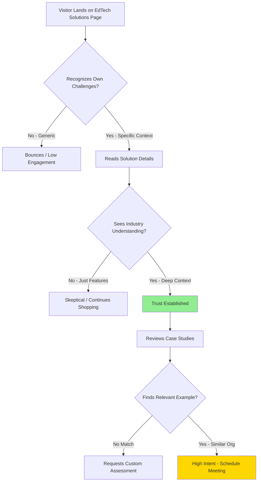

# EdTech Solutions Context Enhancement - Planning PRP

**Status:** Research & Planning Phase
**Created:** October 12, 2025
**Type:** Content Enhancement with Industry Research
**Priority:** High - Conference Preparation

---

## Executive Summary

### Problem Statement
The EdTech Solutions page currently presents 8 solution categories and 8 prospect case studies without sufficient industry context. While the solutions are technically sound, they lack the critical framing that demonstrates deep understanding of current EdTech challenges, trends, and transformation drivers that organizations are facing in 2025.

**Key Gap:** Visitors cannot immediately see that we understand:
- Why these solutions matter NOW
- What industry shifts are driving the need
- How current events/trends create urgency
- Why traditional approaches are failing

### Solution Overview
Conduct comprehensive web research on each solution category and case study organization to:

1. **Add Industry Context Statements** - Rich contextual framing for each of the 8 solution categories showing we understand current industry dynamics
2. **Enhance Case Studies** - Deep context for each of the 8 prospect solutions showing knowledge of specific organizational challenges
3. **Trend Integration** - Connect solutions to observable market trends, conference themes, and industry transformation patterns
4. **Authority Building** - Position AR Automation as industry experts who deeply understand EdTech operational challenges

### Success Criteria
- [ ] Each solution category has 2-3 paragraph industry context statement
- [ ] Each case study includes organization-specific context and current challenges
- [ ] All claims supported by recent industry research/sources
- [ ] Context demonstrates implicit understanding without being preachy
- [ ] Visitors immediately recognize we "get" their world

---

## Research Phase Plan

### Phase 1: Solution Category Deep Research

For each of the 8 solution categories, research:

#### 1. Skills & Credentials Infrastructure
**Research Questions:**
- What's driving the shift from degrees to skills-based credentials?
- How are universities approaching micro-credentials?
- What operational challenges exist in credential issuance at scale?
- Industry examples of successful/failed implementations
- Technology standards (Open Badges, CLR, Verifiable Credentials)

**Search Queries:**
- "micro-credentials operational challenges 2024-2025"
- "skills-based education infrastructure needs"
- "digital credential issuance at scale"
- "alternative credentials market trends"
- "competency-based education technology"

#### 2. AI Integration & Compliance Infrastructure
**Research Questions:**
- What compliance challenges are EdTech companies facing with AI?
- FERPA, GDPR, and regional AI regulations in education
- Common AI integration pitfalls for EdTech startups
- Cost of AI compliance for small/medium EdTech companies
- Market examples of AI compliance issues

**Search Queries:**
- "EdTech AI compliance challenges 2024-2025"
- "FERPA GDPR AI education regulations"
- "EdTech AI integration operational costs"
- "responsible AI deployment education"
- "AI governance frameworks EdTech"

#### 3. Assessment Automation Platform
**Research Questions:**
- Digital transformation in standardized testing
- Language assessment automation trends (TOEFL, IELTS, etc.)
- Portfolio assessment scaling challenges
- AI in assessment scoring - adoption and concerns
- Multi-country assessment coordination challenges

**Search Queries:**
- "assessment automation EdTech trends 2024-2025"
- "AI-powered test scoring market"
- "language assessment digital transformation"
- "portfolio assessment at scale challenges"
- "remote proctoring technology evolution"

#### 4. EdTech Product Operations Infrastructure
**Research Questions:**
- What operational bottlenecks do scaling EdTech companies face?
- Common customer onboarding challenges for EdTech SaaS
- SIS/LMS integration pain points
- Evidence/impact data collection requirements
- International expansion operational challenges

**Search Queries:**
- "EdTech scaling operational challenges"
- "SIS LMS integration complexity"
- "EdTech customer onboarding automation"
- "EdTech efficacy evidence requirements"
- "EdTech international expansion operations"

#### 5. International Student Lifecycle Automation
**Research Questions:**
- International student mobility trends post-COVID
- Cross-border credential recognition challenges
- Multilingual student services automation
- Visa processing bottlenecks for universities
- International enrollment operational costs

**Search Queries:**
- "international student enrollment trends 2024-2025"
- "cross-border credential recognition automation"
- "multilingual student services technology"
- "university international admissions challenges"
- "study abroad operational efficiency"

#### 6. Education Finance Operations
**Research Questions:**
- School financing market in India and emerging markets
- Loan processing challenges for affordable schools
- Alternative student finance models (ISAs, etc.)
- Credit assessment for underbanked schools
- Portfolio management for education lenders

**Search Queries:**
- "education finance market trends 2024-2025"
- "school loan processing automation"
- "affordable private schools financing challenges"
- "income share agreements education"
- "EdTech lending operational efficiency"

#### 7. Publisher Digital Transformation Infrastructure
**Research Questions:**
- Education publisher digital transformation trends
- Shift from print to digital content production
- AI in curriculum development and QA
- Publisher-school network relationship management
- Government curriculum partnership workflows

**Search Queries:**
- "education publisher digital transformation 2024-2025"
- "AI curriculum development quality assurance"
- "publisher school network management"
- "digital textbook production automation"
- "government education content partnerships"

#### 8. School Group Operations Platform
**Research Questions:**
- Multi-campus school network operational challenges
- International school network management trends
- Cross-border compliance for school groups
- Multi-site enrollment and finance consolidation
- ESG reporting requirements for education operators

**Search Queries:**
- "multi-campus school operations challenges"
- "international school network management"
- "school group financial consolidation"
- "education ESG reporting requirements 2024-2025"
- "franchise education operations automation"

---

### Phase 2: Case Study Organization Research

For each of the 8 prospect organizations, research:

#### 1. Varthana (School Finance - India)
**Research Focus:**
- Current scale and growth trajectory
- Affordable school financing model details
- Operational challenges at 5,000+ school scale
- Technology stack and automation gaps
- Recent news, funding, partnerships

**Search Queries:**
- "Varthana school finance India"
- "Varthana operations scale challenges"
- "affordable school financing India market"
- "Varthana technology automation"

#### 2. EtonHouse (International School Network)
**Research Focus:**
- Current global footprint and expansion plans
- Multi-country operational model
- Technology infrastructure and gaps
- Parent communication challenges at scale
- Recent initiatives and strategic direction

**Search Queries:**
- "EtonHouse International school network 2024-2025"
- "EtonHouse operations technology"
- "international school network challenges"
- "EtonHouse expansion strategy"

#### 3. SpaceBasic (Campus Operations EdTech - India)
**Research Focus:**
- Current product offerings and positioning
- Growth trajectory and funding
- University customer onboarding process
- Competitive landscape
- Integration challenges with university systems

**Search Queries:**
- "SpaceBasic EdTech India campus operations"
- "SpaceBasic customer base growth"
- "campus operations automation market India"
- "SpaceBasic competitors alternatives"

#### 4. Aksorn Education (Publisher + School Network - Thailand)
**Research Focus:**
- Digital transformation journey and current state
- Teacher training program scale and methodology
- School network management approach
- Government partnership requirements
- Technology infrastructure and gaps

**Search Queries:**
- "Aksorn Education Thailand digital transformation"
- "Aksorn teacher training programs"
- "Thailand education publisher market"
- "Aksorn EdTech investments"

#### 5. Leverage Edu (Study Abroad Platform - India)
**Research Focus:**
- Current scale (7.5M students/month validation)
- Counseling workflow and bottlenecks
- Document processing challenges
- Technology stack and automation level
- International expansion plans

**Search Queries:**
- "Leverage Edu study abroad platform"
- "Leverage Edu operations scale"
- "study abroad counseling automation"
- "Leverage Edu technology stack"

#### 6. Kaizenvest Portfolio (VC Portfolio)
**Research Focus:**
- Portfolio composition and focus areas
- Common operational challenges across portfolio
- Value-add services offered to portfolio companies
- Investment thesis on operational efficiency
- Recent portfolio company additions

**Search Queries:**
- "Kaizenvest EdTech portfolio companies"
- "Kaizenvest investment strategy"
- "EdTech VC portfolio operational support"
- "Kaizenvest Asia EdTech investments"

#### 7. Nahdet Misr (Publisher + EdVentures VC - MENA)
**Research Focus:**
- Egyptian Ministry of Education partnerships
- Digital curriculum production workflow
- EdVentures portfolio focus
- MENA EdTech market dynamics
- Technology and operational maturity

**Search Queries:**
- "Nahdet Misr publisher Egypt"
- "EdVentures MENA EdTech investments"
- "Egypt digital curriculum Ministry of Education"
- "Nahdet Misr digital transformation"

#### 8. EY-Parthenon Education Clients (Consulting Partnership)
**Research Focus:**
- EY-Parthenon education practice focus areas
- Common client challenges and engagement types
- Strategy-to-implementation gap in consulting
- Technology implementation partnership models
- India and MENA education market insights

**Search Queries:**
- "EY-Parthenon education consulting practice"
- "education consulting implementation challenges"
- "strategy consulting technology partnerships"
- "EY education sector India MENA"

---

## Research Methodology

### Web Research Approach

1. **Primary Sources**
   - Industry reports (HolonIQ, EdSurge, etc.)
   - Academic research on EdTech trends
   - Government education policy documents
   - Technology provider white papers
   - Conference proceedings and session themes

2. **Secondary Sources**
   - EdTech news publications (EdSurge, THE, etc.)
   - Company announcements and press releases
   - LinkedIn articles by industry leaders
   - Case studies from technology providers
   - Industry analyst reports

3. **Validation Approach**
   - Cross-reference multiple sources
   - Prioritize recent (2024-2025) information
   - Connect to EdTech Asia Summit 2025 themes
   - Validate against existing research (solution-mapping.md, speakers.md)

### Documentation Standards

For each research finding:
- **Source**: URL and publication/author
- **Date**: When published/accessed
- **Relevance**: How it supports context statement
- **Quote/Stat**: Specific data or insight
- **Application**: How to incorporate into content

---

## Content Enhancement Strategy

### Industry Context Statement Structure

For each solution category:

```markdown
## [Solution Category Name]

### Industry Context
**The Challenge:** [2-3 sentences on current industry challenge/trend]

**Why Now:** [1-2 sentences on urgency/timing/market shift]

**Traditional Approach Failing:** [1-2 sentences on why old methods don't work]

**What's Needed:** [1 sentence transition to our solution]

### [Existing description and features]
```

### Case Study Enhancement Structure

For each prospect solution:

```markdown
## [Organization Name]

### Organization Context
**Market Position:** [Current scale, geography, strategic focus]

**Current Challenge:** [Specific operational pain point with industry context]

**Why This Matters:** [Broader industry trend this exemplifies]

### [Existing technical implementation and value pitch]
```

---

## User Flow Diagram



---

## Technical Implementation Plan

### Phase 1: Research Execution (Days 1-3)
**Deliverable:** Research findings document

1. **Day 1: Solution Category Research (1-4)**
   - Skills & Credentials Infrastructure
   - AI Integration & Compliance Infrastructure
   - Assessment Automation Platform
   - EdTech Product Operations Infrastructure

2. **Day 2: Solution Category Research (5-8)**
   - International Student Lifecycle Automation
   - Education Finance Operations
   - Publisher Digital Transformation Infrastructure
   - School Group Operations Platform

3. **Day 3: Case Study Organization Research**
   - All 8 prospect organizations
   - Validation and cross-referencing

**Output Format:**
```markdown
# Research Findings: [Solution/Organization Name]

## Key Insights
- [Insight 1 with source]
- [Insight 2 with source]
- [Insight 3 with source]

## Industry Trends
- [Trend 1 with stats/source]
- [Trend 2 with stats/source]

## Specific Challenges
- [Challenge 1 with examples]
- [Challenge 2 with examples]

## Context Statement Draft
[Proposed 2-3 paragraph context]

## Sources
1. [Source 1 - URL, date, relevance]
2. [Source 2 - URL, date, relevance]
```

### Phase 2: Content Enhancement (Days 4-5)

1. **Update edtech-solutions.ts**
   - Add `industryContext` field to each solutionCategory
   - Add `organizationContext` field to each prospectSolution
   - Populate with research-backed context statements

2. **Update SolutionCategoryCard.tsx**
   - Display industry context in expandable section
   - Visual treatment to highlight "Industry Challenge" framing
   - Smooth transitions and readable formatting

3. **Update ProspectSolutionTabs.tsx**
   - Add organization context section to each case study
   - Visual separation between context and technical details
   - Ensure mobile responsiveness

### Phase 3: Visual Enhancement (Day 6)

1. **Add Context Icons/Badges**
   - "Market Trend" badge
   - "Industry Challenge" indicator
   - "Conference Theme" connection tag

2. **Improve Readability**
   - Typography hierarchy for context vs. features
   - Color coding for different information types
   - Expandable/collapsible sections for depth

3. **A/B Testing Preparation**
   - Track engagement metrics on context sections
   - Monitor time-on-page improvements
   - Measure conversion rate impact

---

## Data Models

### Enhanced SolutionCategory Interface

```typescript
export interface SolutionCategory {
  id: string;
  title: string;
  description: string;

  // NEW: Industry context
  industryContext: {
    challenge: string;        // Current industry challenge (2-3 sentences)
    whyNow: string;           // Urgency/timing factors (1-2 sentences)
    traditionalFailure: string; // Why old approaches don't work (1-2 sentences)
    sources: ContextSource[]; // Research sources
  };

  targetAudience: string[];
  roiMetric: string;
  keyFeatures: string[];
  useCases: string[];
  icon: string;
  color: string;
}

interface ContextSource {
  title: string;
  url: string;
  date: string;
  publisher: string;
}
```

### Enhanced ProspectSolution Interface

```typescript
export interface ProspectSolution {
  id: string;
  organization: string;
  organizationType: string;
  geography: string;
  scale: string;

  // NEW: Organization context
  organizationContext: {
    marketPosition: string;   // Current scale, strategic focus
    currentChallenge: string; // Specific operational pain point
    industryRelevance: string; // Broader trend this exemplifies
    sources: ContextSource[];
  };

  problem: string;
  technicalImplementation: string[];
  timeSavings: string;
  valuePitch: string;
  solutionModels?: string[];
}
```

---

## Implementation Phases

### Phase 1: Foundation Research ✓
**Objective:** Gather comprehensive industry intelligence

**Tasks:**
- [ ] Execute web research for all 8 solution categories
- [ ] Execute web research for all 8 case study organizations
- [ ] Document findings with sources
- [ ] Draft context statements
- [ ] Validate against existing research (solution-mapping.md, speakers.md)

**Success Metrics:**
- 5+ credible sources per solution category
- 3+ sources per case study organization
- All context statements backed by research
- Alignment with EdTech Asia Summit 2025 themes

### Phase 2: Content Integration
**Objective:** Enhance TypeScript data structures and content

**Tasks:**
- [ ] Update TypeScript interfaces (add industryContext, organizationContext)
- [ ] Populate all 8 solution categories with context
- [ ] Populate all 8 case studies with organization context
- [ ] Add source citations
- [ ] Review for tone and clarity

**Success Metrics:**
- All solutions have complete industry context
- All case studies have organization context
- No unsourced claims
- Consistent tone across all content

### Phase 3: UI/UX Enhancement
**Objective:** Present context effectively

**Tasks:**
- [ ] Update SolutionCategoryCard component
- [ ] Update ProspectSolutionTabs component
- [ ] Add visual hierarchy for context sections
- [ ] Implement responsive design
- [ ] Add expand/collapse functionality

**Success Metrics:**
- Context is prominently displayed
- Mobile-friendly presentation
- Smooth transitions and interactions
- Accessibility compliance (WCAG 2.1 AA)

### Phase 4: Testing & Validation
**Objective:** Ensure quality and impact

**Tasks:**
- [ ] Review all content for accuracy
- [ ] Cross-check sources are still live
- [ ] Test on multiple devices/browsers
- [ ] Gather internal feedback
- [ ] Make final adjustments

**Success Metrics:**
- Zero broken source links
- Consistent rendering across browsers
- Positive internal review
- Ready for conference launch

---

## Risk Assessment & Mitigation

### Risk 1: Research Overload
**Description:** Too much information, analysis paralysis
**Probability:** Medium
**Impact:** High (delays launch)
**Mitigation:**
- Set strict research time limits (3 days max)
- Focus on 2024-2025 sources only
- Prioritize conference-aligned themes
- Use research template for consistency

### Risk 2: Context Too Generic
**Description:** Industry context sounds like boilerplate
**Probability:** Medium
**Impact:** High (defeats purpose)
**Mitigation:**
- Include specific stats and examples
- Reference observable trends (conference themes, recent news)
- Use concrete language, not buzzwords
- Test with someone outside the team

### Risk 3: Source Credibility
**Description:** Relying on low-quality or biased sources
**Probability:** Low
**Impact:** High (undermines authority)
**Mitigation:**
- Prioritize industry reports, academic research, reputable news
- Cross-reference claims across multiple sources
- Avoid vendor marketing content as primary sources
- Include source links for transparency

### Risk 4: Scope Creep
**Description:** Adding features beyond context enhancement
**Probability:** High
**Impact:** Medium (delays completion)
**Mitigation:**
- Stick to defined interfaces (industryContext, organizationContext)
- Resist adding new solution categories
- Save additional ideas for future iterations
- Focus on conference preparation deadline

### Risk 5: Mobile Experience
**Description:** Context sections make mobile view cluttered
**Probability:** Medium
**Impact:** Medium (poor UX)
**Mitigation:**
- Design mobile-first
- Use collapsible sections
- Test on multiple device sizes
- Prioritize readability over completeness on small screens

---

## Success Metrics

### Quantitative Metrics

1. **Content Completeness**
   - Target: 100% of solutions have industry context
   - Target: 100% of case studies have organization context
   - Target: Average 5+ sources per solution

2. **Engagement Metrics** (Post-Launch)
   - Time on page: +30% increase
   - Scroll depth: 75%+ reach case studies section
   - CTA click-through: +20% increase

3. **Conference Impact**
   - Demo requests: 10+ from conference attendees
   - "You really understand our challenges" feedback: 5+
   - Follow-up meetings scheduled: 8-12

### Qualitative Metrics

1. **Authority Perception**
   - Visitors recognize we understand EdTech challenges
   - Context feels current and relevant
   - Examples resonate with target audience

2. **Differentiation**
   - Stands out from generic "workflow automation" messaging
   - Demonstrates EdTech-specific expertise
   - Builds trust before first conversation

3. **Internal Confidence**
   - Sales team feels equipped with industry knowledge
   - Founders can reference research in conversations
   - Conference prep feels comprehensive

---

## Appendix A: Research Question Bank

### General EdTech Industry
- What are the top 5 operational challenges for EdTech companies in 2024-2025?
- How is AI changing education operations?
- What regulatory changes are affecting EdTech?
- What are the dominant themes at major EdTech conferences?
- Which EdTech segments are growing fastest?

### Technology Trends
- What workflow automation tools are EdTech companies adopting?
- How prevalent is AI in education administration?
- What integration challenges do EdTech companies face?
- What are the leading EdTech technology stacks?

### Market Dynamics
- Who are the major players in each solution category?
- What are typical contract sizes in EdTech B2B?
- How do EdTech companies typically procure automation solutions?
- What ROI do EdTech operators expect from automation?

### Geographic Focus
- What are unique EdTech challenges in India?
- How is the MENA EdTech market evolving?
- What drives EdTech growth in Southeast Asia?
- How do international schools approach operations?

---

## Appendix B: Component Update Specifications

### SolutionCategoryCard.tsx Enhancement

```typescript
// Add industry context section above description
<Card>
  <CardHeader>
    <Icon />
    <CardTitle>{category.title}</CardTitle>
  </CardHeader>

  <CardContent>
    {/* NEW: Industry Context Section */}
    <div className="mb-6 p-4 bg-accent/50 rounded-lg border-l-4 border-primary">
      <h4 className="text-sm font-semibold text-muted-foreground mb-2 flex items-center gap-2">
        <TrendingUp className="w-4 h-4" />
        Industry Challenge
      </h4>
      <p className="text-sm leading-relaxed">
        {category.industryContext.challenge}
      </p>

      <Collapsible>
        <CollapsibleTrigger className="text-xs text-primary mt-2">
          Read more about this trend →
        </CollapsibleTrigger>
        <CollapsibleContent>
          <p className="text-sm mt-2">{category.industryContext.whyNow}</p>
          <p className="text-sm mt-2">{category.industryContext.traditionalFailure}</p>
        </CollapsibleContent>
      </Collapsible>
    </div>

    {/* Existing description and features */}
    <p className="text-muted-foreground mb-4">{category.description}</p>
    {/* ... rest of card ... */}
  </CardContent>
</Card>
```

### ProspectSolutionTabs.tsx Enhancement

```typescript
// Add organization context section at top of each tab
<TabsContent value={solution.id}>
  {/* NEW: Organization Context Banner */}
  <div className="mb-6 p-6 bg-gradient-to-br from-primary/5 to-accent/20 rounded-xl border">
    <div className="flex items-start gap-4">
      <Building2 className="w-6 h-6 text-primary mt-1" />
      <div>
        <h4 className="font-semibold mb-2">About {solution.organization}</h4>
        <p className="text-sm text-muted-foreground mb-3">
          {solution.organizationContext.marketPosition}
        </p>
        <div className="flex items-start gap-2">
          <AlertCircle className="w-4 h-4 text-orange-500 mt-0.5 flex-shrink-0" />
          <p className="text-sm">
            <span className="font-medium">Current Challenge:</span>{' '}
            {solution.organizationContext.currentChallenge}
          </p>
        </div>
      </div>
    </div>
  </div>

  {/* Existing technical implementation */}
  <div className="space-y-6">
    {/* ... existing content ... */}
  </div>
</TabsContent>
```

---

## Appendix C: Example Context Statements (Draft)

### Example: Skills & Credentials Infrastructure

**Industry Context:**

**The Challenge:** Education is undergoing a fundamental shift from degree-based to skills-based credentialing. Universities are launching micro-credential and executive education programs, EdTech platforms are issuing digital badges, and employers are demanding verifiable skills rather than traditional degrees. However, most institutions lack the operational infrastructure to issue, verify, and make credentials portable at scale. Manual processes that worked for annual degree issuance collapse when faced with thousands of micro-credentials issued monthly across multiple programs.

**Why Now:** The EdTech Asia Summit 2025 has "Strategic Pathways: Creating Integrated Systems for Skills, Credentials, and Careers" as a dominant theme, reflecting the urgency organizations feel. LinkedIn's skills-first hiring initiatives, the rise of competency-based education frameworks, and government push for alternative credentials (especially for equity and upskilling) create immediate demand for infrastructure that doesn't exist.

**Traditional Approach Failing:** Universities are attempting to build credential systems in-house or using basic learning management system features, but these approaches don't handle cross-platform portability, employer verification workflows, or skills-to-employment matching at scale. The result: expensive custom development, fragmented credential ecosystems, and poor employer adoption.

**Sources:**
- EdTech Asia Summit 2025 Agenda - "Skills, Credentials, and Careers" track
- LinkedIn Economic Graph Report 2024 - Skills-first hiring trends
- HolonIQ "EdTech in 2025" - Alternative credentials market growth

---

## Next Steps

1. **Immediate:** Begin web research Phase 1 (Solution Categories 1-4)
2. **Day 2:** Continue web research Phase 1 (Solution Categories 5-8)
3. **Day 3:** Execute web research Phase 2 (All case study organizations)
4. **Day 4-5:** Content integration and TypeScript updates
5. **Day 6:** UI/UX enhancement and testing

**Decision Point:** After completing research (Day 3), review findings with stakeholders to ensure context statements align with conference positioning and brand voice before proceeding to implementation.

---

**End of Planning PRP**

*Ready for transition to Implementation PRP once research phase is complete and context statements are approved.*
